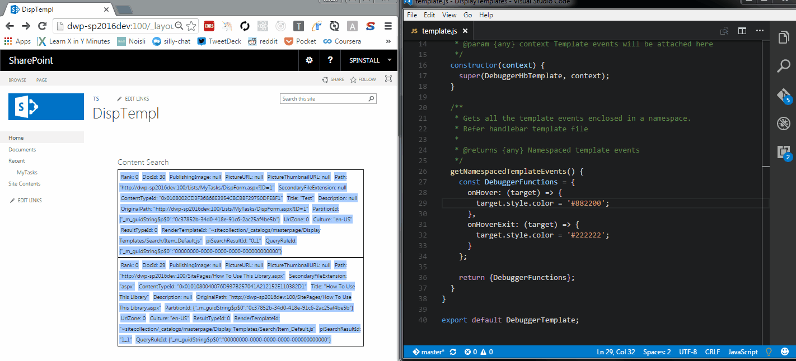

# SharePoint Display Templates with Handlebars and LiveReload [](https://travis-ci.org/ravikiranvs/DisplayTemplatesLiveReload)

Sample code for creating Display Template with Handlebars and LiveReload.

## Here is how it's going to work


# Liberaries and Tools
You may need a slight understanding of the below liberaries and tools: 
* [Handlebars](http://handlebarsjs.com/)
* [LiveReload](http://livereload.com/)
* [Babel](https://babeljs.io/)
* [webpack](https://webpack.github.io/)
* [ESLint](http://eslint.org/), [Karma](https://karma-runner.github.io), [Mocha](https://mochajs.org/), [Chai](http://chaijs.com/)

# Display Template

## The Sharepoint Display Template File
Code that goes into the Display Template: (See full code [here](./display_templates_save/Control_Kiran.html))
``` html
    <script>
        $includeScript(this.url, "~site/Style Library/scripts/debugging-display-template.bundle.js");
    </script>


    <div id="Control_List">
      <!--#_
      var HtmlToRender = window.NamespacedDebugTemplateRenderer(ctx);
      _#-->
      _#= HtmlToRender =#_
    </div>
```

## The Handlebars Template
The Handlebars template is a `.html` file as seen in [template.html](src/display-templates/debugger/template.html)

The JavaScript functions used within the Handlebars template are namespaced like so: `onmouseover='DebuggerFunctions.onHover(this)'`

## Template Function Definitions
This is sort of like the code behind file for the Handlebars template. You have to create a `TemplateBuilder` class as done in [template.js](src/display-templates/debugger/template.js) 

The Handlebars template is imported into this file. See the [handlebars-loader](https://github.com/pcardune/handlebars-loader) to know how this works.

Apart from the `constructor` method you will need to create a method `getNamespacedTemplateEvents` where the namespaced events are defined.

## Using the template
The [index.js](./src/display-templates/debugger/index.js) file defines a function which takes the display template's context and returns HTML as a string.
This function is called from the [SharePoint display template](./display_templates_save/Control_Kiran.html))

This is also the entry point for webpack. See [webpack's configuration](webpack-config).

### Important lines of code

``` JavaScript
const debuggerTemplate = new DebuggerTemplate(window);
return debuggerTemplate.renderAsString({ items });
```
This creates an object of the TemplateBuilder class and the namespaced functions are assigned to the DOM `window`.
And the HTML is generated from binding the template to the data and returned as a string.

# Unit Testing
The unit testing is run using Karma. It is configured to run in both IE and Chrome. See configuration file [here](karma-config/karma.conf.default.js).

> Running the unit tests: `npm run test`

## Test Helper
The [template-test-helper.js](src/display-templates/template-test-helper.js) defines a function `renderTemplate` which takes a class inhereted from `TemplateBuilder` and data as its parameters and returns a jQuery object of the rendered html's first element.

## Writing Unit Tests
The unit test files can be placed anywhere within the `src` folder but has to end with the extention `.spec.js`

We have couple of testcases written for the persentage-column JSLink script [here](src/display-templates/debugger/template.spec.js).

Using the [template-test-helper.js](src/display-templates/template-test-helper.js) we get the jQuery object of the persent-column template's root element.

The Asserts are done using the [chai-jquery](http://aaronsofaly.github.io/chai-docs/plugins/chai-jquery/) liberary.

# Build
> Generating the bundled and minified file for development: `npm run dev`

> Generating the bundled and minified file for production: `npm run build`

# Configuring the Display Template in a Content Search Webpart
This should be done using code but this is out of scope of this repo. You can follow manual steps for doing this:
1. Copy the `debugging-display-template.bundle.js` present in `CDN\scripts` folder (after bulding ofcourse) to the SiteCollection's Style Liberary in a folder called `scripts`.
2. Upload the display template to a publishing site's Master page gallery into the display templates folder.
3. Create a Content Search webpart and select the Display Template in its options.

# Live Reload
> Continuously build and host files and start the LiveReload server: `npm start`

Injecting the LiveReload script tag on the SharePoint Page. Use this Chrome Extention - [LiveReload](https://chrome.google.com/webstore/detail/livereload/jnihajbhpnppcggbcgedagnkighmdlei)

Replacing the browser's requests for the script file from server with requests to localhost:7777. This is done using the Chrome Extention [Switcheroo Redirector](https://chrome.google.com/webstore/detail/switcheroo-redirector/cnmciclhnghalnpfhhleggldniplelbg).

If you wish to change the port number to something else, see the cnd script command in the [package.json](./package.json) file.

#### That's it! This should now enable livereloading.
